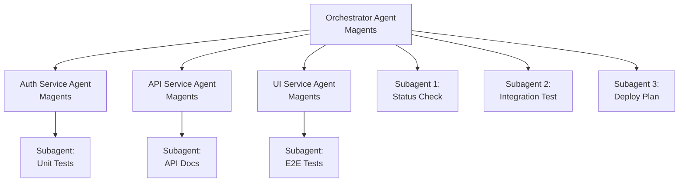

# 🤝 Magents + Claude Subagents Integration Guide

## Understanding the Synergy

Magents and Claude's subagents feature serve different but complementary purposes in multi-agent workflows. This guide explains how to leverage both for maximum productivity.

## Key Differences

### Claude Subagents
- **Built-in to Claude Code**: No additional setup required
- **Task-level parallelism**: Spawn agents for specific subtasks
- **Ephemeral**: Exist only during the conversation
- **Shared context**: Access same tools as parent (except spawning more subagents)
- **Synchronous results**: Report back to parent agent

### Magents
- **External orchestration**: Manages Claude Code instances
- **Branch-level parallelism**: Each agent on different git branch
- **Persistent**: Survive across sessions via tmux/Docker
- **Isolated context**: Separate processes and environments
- **Asynchronous coordination**: Agents work independently

## Integration Patterns

### 1. Hierarchical Orchestration Pattern

Use Magents to create a hierarchy of specialized agents, then use subagents within each for parallel execution.

```bash
# Create orchestrator agent
magents create main orchestrator \
  --task "Coordinate microservices development"

# Create service agents
magents create feature/auth auth-agent \
  --task "Implement authentication service"

magents create feature/api api-agent \
  --task "Implement REST API"

magents create feature/ui ui-agent \
  --task "Build React frontend"
```

Within the orchestrator agent:
```markdown
Please use subagents to:
1. Check the current implementation status in each service agent's worktree
2. Identify integration points between services
3. Create a coordination plan for the next development phase
```

### 2. Verification and Testing Pattern

Use subagents to verify work across different Magents agents.

In your main development agent:
```markdown
I've implemented the authentication API. Please spawn subagents to:

1. Verify the API contract matches what the frontend agent expects
   - Check /path/to/ui-agent/src/api/auth.ts
   - Compare with our implementation in /src/routes/auth.js

2. Test the integration between services
   - Run integration tests across worktrees
   - Check for breaking changes

3. Validate security best practices
   - Review authentication flow
   - Check for common vulnerabilities
```

### 3. Research and Exploration Pattern

Create exploration agents with Magents, use subagents for parallel research.

```bash
# Create research agents
magents create research/graphql graphql-agent \
  --task "Evaluate GraphQL for our API"

magents create research/grpc grpc-agent \
  --task "Evaluate gRPC for our API"

magents create research/rest rest-agent \
  --task "Evaluate REST best practices"
```

Within each research agent:
```markdown
Please use subagents to research:
1. Performance benchmarks for this approach
2. Community adoption and ecosystem
3. Integration complexity with our stack
4. Long-term maintenance considerations

Compile findings into a comprehensive report.
```

### 4. Code Review and Quality Pattern

Use Magents for feature branches, subagents for comprehensive review.

```bash
# Developer creates feature
magents create feature/payment payment-agent \
  --task "Implement payment processing"

# Reviewer creates review agent
magents create review/payment review-agent \
  --task "Review payment implementation"
```

In the review agent:
```markdown
Please spawn subagents to review the payment implementation:

1. Code quality analysis
   - Check /path/to/payment-agent worktree
   - Look for code smells and anti-patterns
   - Verify test coverage

2. Security review
   - Analyze payment data handling
   - Check for PCI compliance issues
   - Review encryption implementation

3. Performance analysis
   - Check for N+1 queries
   - Analyze payment processing flow
   - Suggest optimizations
```

## Best Practices

### 1. Use Magents for Persistent Work
- Feature development
- Long-running tasks
- Branch-specific work
- Multi-repository coordination

### 2. Use Subagents for Parallel Analysis
- Code verification
- Research tasks
- Testing and validation
- Cross-agent coordination

### 3. Combine for Complex Workflows



## Advanced Integration Examples

### Multi-Stage Development Pipeline

```bash
#!/bin/bash
# setup-pipeline.sh

# Stage 1: Create development agents
magents create feature/backend backend-dev \
  --task "Implement backend features"

magents create feature/frontend frontend-dev \
  --task "Implement frontend features"

# Stage 2: Create testing agent
magents create test/integration test-agent \
  --task "Run integration tests using subagents"

# Stage 3: Create deployment agent
magents create deploy/staging deploy-agent \
  --task "Coordinate deployment using subagents"
```

### Cross-Repository Coordination

```bash
# Create agents for different repositories
magents create feature/api api-agent \
  --task "Work on API repository"

magents create feature/web web-agent \
  --task "Work on web repository"

magents create feature/mobile mobile-agent \
  --task "Work on mobile repository"

# Create coordinator
magents create main coordinator \
  --task "Coordinate cross-repo changes using subagents"
```

In the coordinator:
```markdown
We need to implement a breaking API change. Please use subagents to:

1. Analyze impact across all repositories
   - Check api-agent worktree for API changes
   - Check web-agent worktree for client usage
   - Check mobile-agent worktree for mobile client usage

2. Create migration plan
   - Generate compatibility layer
   - Plan phased rollout
   - Update documentation

3. Coordinate implementation
   - Create tracking issues
   - Update CI/CD pipelines
   - Plan deployment sequence
```

## Performance Considerations

### Token Usage
- Magents agents have separate context windows
- Subagents share parent's token budget
- Use Magents for large, independent tasks
- Use subagents for focused, related tasks

### Parallel Execution
- Magents: True parallel execution (different processes)
- Subagents: Parallel within Claude's execution model
- Combine for maximum parallelism

### Resource Management
```bash
# Limit Magents for resource-constrained environments
export MAGENTS_MAX_AGENTS=3

# Use subagents for lightweight parallel tasks
# within each Magents agent
```

## Troubleshooting Integration Issues

### Issue: Subagents Can't Access Other Worktrees
**Solution**: Provide explicit paths to other agent worktrees
```markdown
Please check the implementation in:
/Users/dev/project-auth-agent/src/auth.js
```

### Issue: Context Confusion
**Solution**: Use clear naming and task descriptions
```bash
magents create feature/auth auth-agent \
  --task "AUTH SERVICE: Implement JWT authentication"
```

### Issue: Coordination Overhead
**Solution**: Create dedicated orchestrator agents
```bash
magents create main orchestrator \
  --task "ORCHESTRATOR: Coordinate all feature development"
```

## Future Possibilities

As both Magents and Claude subagents evolve, we envision:

1. **Direct Integration**: Magents could provide APIs for subagents to query agent status
2. **Shared State**: Coordination database accessible by all agents
3. **Workflow Automation**: Automatic subagent spawning based on Magents events
4. **Enhanced Monitoring**: Unified dashboard for all agent activity

## Conclusion

Magents and Claude subagents are powerful individually but transformative when combined. Use Magents for persistent, branch-level work and subagents for dynamic, task-level parallelism. This combination enables sophisticated multi-agent workflows that can tackle complex software development challenges.